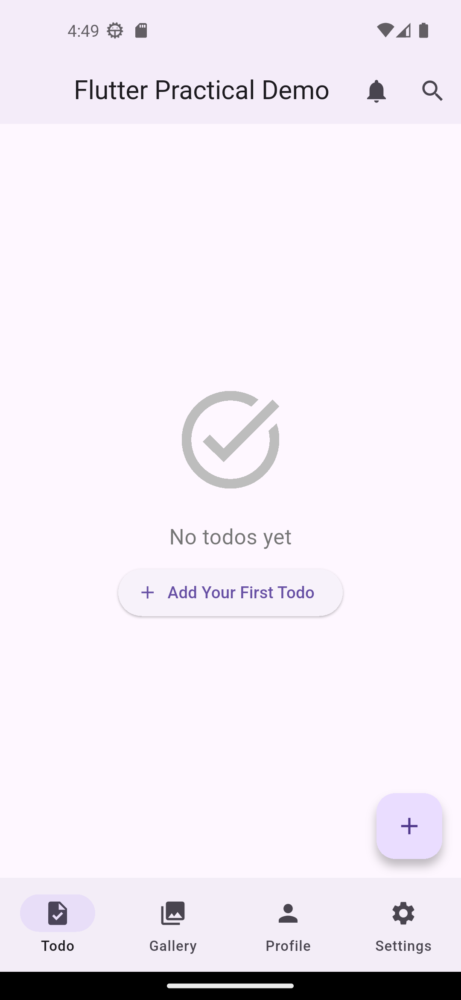
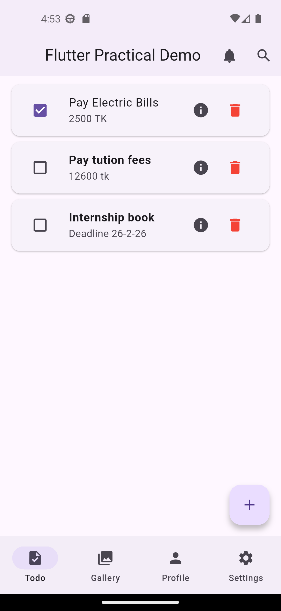
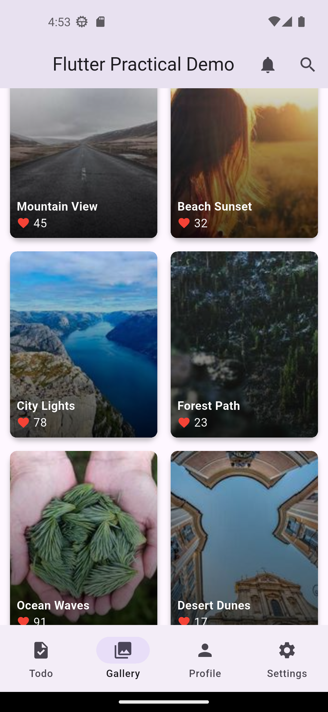
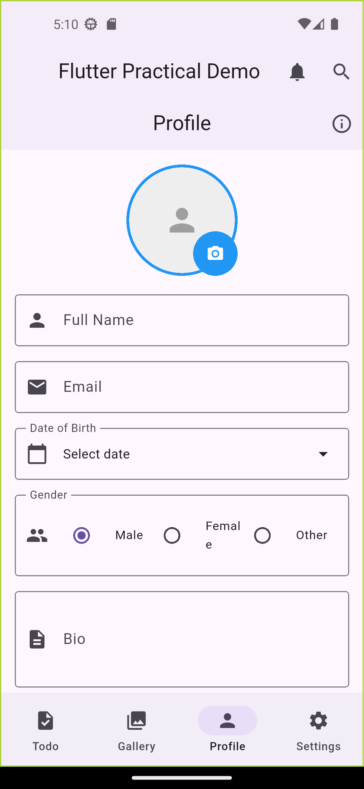
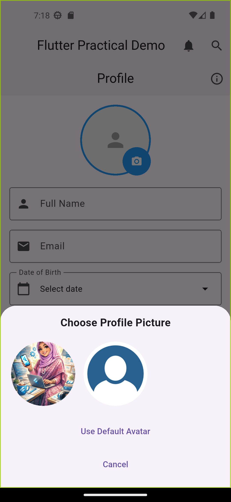
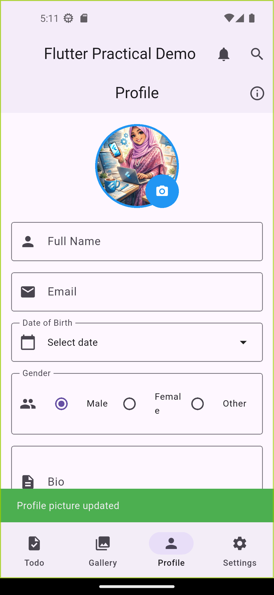
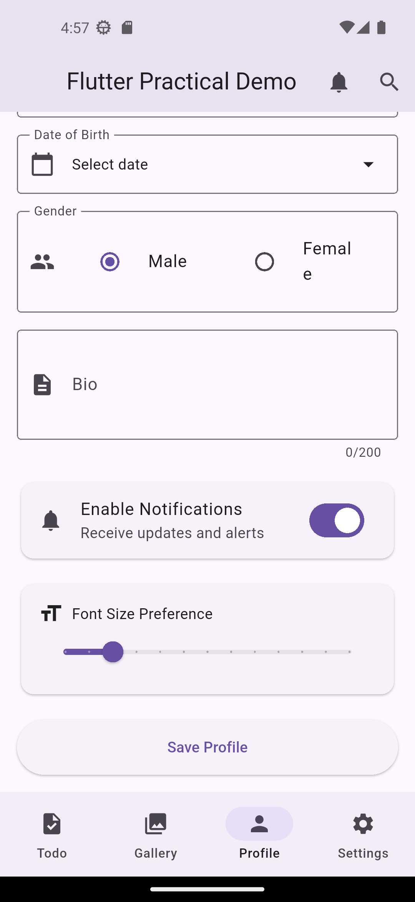
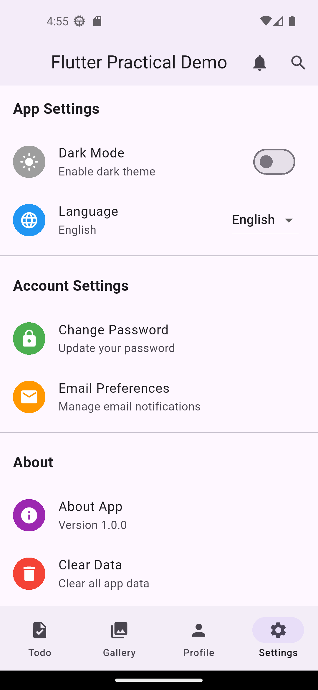
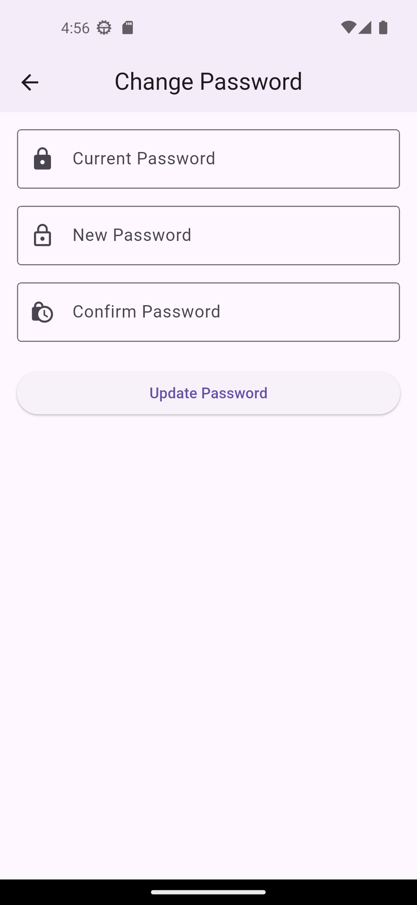
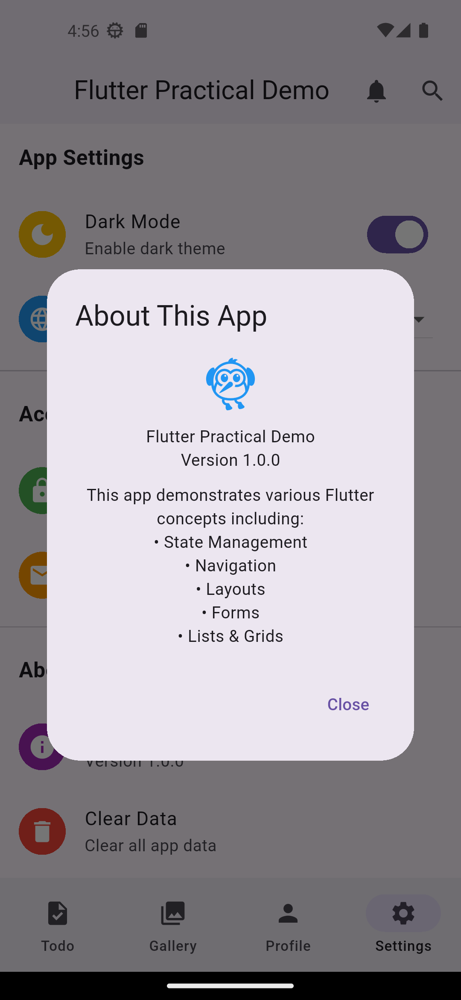

# 🚀 Flutter Practical Demo App

A comprehensive Flutter application demonstrating core concepts including state management, navigation, layouts, forms, and interactive UI components with real-world use cases.

## 📱 Features

- ✅ **Todo List** - Create, read, update,Search and delete tasks
- 🖼️ **Image Gallery** - Grid view with full-screen image viewer
- 👤 **Profile Management** - Form validation and user preferences
- ⚙️ **Settings Panel** - App configuration and password management
- 🎨 **Modern UI** - Material Design 3 with smooth animations
- 📱 **Responsive Layout** - Works on different screen sizes

## 🛠️ Technologies Used

- Flutter SDK
- Dart Programming Language
- Material Design Components
- State Management (setState)
- Navigation & Routing


## 📁 Project Structure

```
lib/
├── main.dart                 # App entry point
├── dashboard_screen.dart      # Main dashboard with bottom navigation
├── todo_screen.dart          # Todo list with CRUD operations
├── gallery_screen.dart       # Image gallery with grid view
├── profile_screen.dart       # User profile with form validation
└── settings_screen.dart      # App settings and preferences
```

## 🎯 Features Breakdown

### 1️⃣ Dashboard Screen
- Bottom navigation bar with 4 tabs
- Search dialog with modal
- Notifications bottom sheet
- Smooth tab transitions

### 2️⃣ Todo List Screen
- Add new todos with title and description
- Mark tasks as complete/incomplete
- Delete tasks
- View task details in modal
- Empty state handling
- Real-time updates with setState

### 3️⃣ Gallery Screen
- Grid view of images from Picsum API
- Pull-to-refresh functionality
- Loading indicators
- Error handling for failed image loads
- Hero animations for image transitions
- Like counts and titles overlay

### 4️⃣ Profile Screen
- Form with validation
- Date picker for birth date
- Radio buttons for gender selection
- Switch for notifications
- Slider for font size preference
- Profile picture with edit option
- Form validation and error messages

### 5️⃣ Settings Screen
- Dark mode toggle
- Language dropdown
- Password change with validation
- Email preferences modal
- About dialog with app info
- Clear data confirmation

## 🧪 Testing

Run tests using:
```bash
flutter test
```

## 📦 Dependencies

```yaml
dependencies:
  flutter:
    sdk: flutter
  cupertino_icons: ^1.0.2
  # No external dependencies used - pure Flutter!
```

## 📋 Prerequisites

Before running this application, make sure you have:

- [Flutter SDK](https://flutter.dev/docs/get-started/install) (version 3.0 or higher)
- [Dart SDK](https://dart.dev/get-dart) (included with Flutter)
- Android Studio / VS Code with Flutter extensions
- An emulator or physical device for testing

## 🚀 Installation

Follow these steps to get the app running on your local machine:

### Step 1: Clone the Repository
```bash
git clone https://github.com/yourusername/flutter-practical-demo.git
cd flutter-practical-demo
```

### Step 2: Install Dependencies
```bash
flutter pub get
```

### Step 3: Run the App
```bash
flutter run
```

### 📱 Platform-Specific Setup

<details>
<summary><b>Android Setup 🤖</b></summary>

1. Open Android Emulator or connect physical device
2. Enable USB debugging on your Android device
3. Run:
```bash
flutter run
```
</details>

<details>
<summary><b>iOS Setup 🍎</b></summary>

1. Open iOS Simulator or connect physical device
2. Install CocoaPods:
```bash
sudo gem install cocoapods
```
3. Navigate to iOS folder and install pods:
```bash
cd ios
pod install
cd ..
```
4. Run:
```bash
flutter run
```
</details>

<details>
<summary><b>Web Setup 🌐</b></summary>

1. Ensure Chrome is installed
2. Run:
```bash
flutter run -d chrome
```
</details>

<details>
<summary><b>Windows Setup 🪟</b></summary>

1. Ensure Windows development tools are installed
2. Run:
```bash
flutter config --enable-windows-desktop
flutter create .
flutter run -d windows
```
</details>

<details>
<summary><b>macOS Setup 💻</b></summary>

1. Ensure macOS development tools are installed
2. Run:
```bash
flutter config --enable-macos-desktop
flutter create .
flutter run -d macos
```
</details>

<details>
<summary><b>Linux Setup 🐧</b></summary>

1. Install Linux development tools:
```bash
sudo apt-get install clang cmake ninja-build pkg-config libgtk-3-dev
```
2. Run:
```bash
flutter config --enable-linux-desktop
flutter create .
flutter run -d linux
```
</details>

## 📊 App Screenshots

<details>

|            Todo List✅                |              Todo List✅              |            Gallery️ 🖼️              |
|:------------------------------------:|:------------------------------------:|:------------------------------------:|
|  |  |  |

|              Profile👤                |               Profile👤               |                 Profile👤            |
|:------------------------------------:|:-------------------------------------:|:------------------------------------:|
|  |  |  |


|              Profile 👤              |              Settings ️⚙️                |             Settings ️⚙️             |
|:------------------------------------:|:------------------------------------:|:------------------------------------:|
|  |  |  |


|             Settings ️⚙️             |
|:------------------------------------:|
|  |

</details>


## 📄 License

This project is licensed under the MIT License - see the [LICENSE](LICENSE) file for details.


## 🎓 What You'll Learn

| Concept | Implementation |
|---------|---------------|
| **Stateful Widgets** | Todo list with dynamic updates |
| **Stateless Widgets** | Static UI components |
| **Navigation** | Push/pop with data passing |
| **Layouts** | Column, Row, Stack, GridView |
| **Forms** | Validation and user input |
| **Lists** | ListView.builder with items |
| **Modals** | Dialogs and bottom sheets |
| **Animations** | Hero transitions |
| **Async** | Future operations with loading states |


## 🚦 Quick Start Guide

1. **Install Flutter** - Follow [official guide](https://flutter.dev/docs/get-started/install)
2. **Clone & Run** - Use commands above
3. **Explore** - Navigate through different tabs
4. **Modify** - Change code and see live reload
5. **Learn** - Understand each concept in action

---

**Made by Nahida with ❤️ using Flutter**